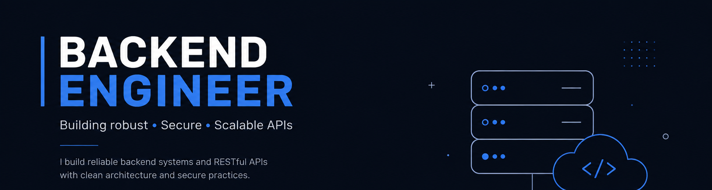

# 💫 About Me:
🔭 I’m currently working on: Building scalable REST APIs and microservices architectures using Node.js / Express.  👯 I’m looking to collaborate on: Open-source backend tools, API integrations, and database optimization projects.  🤝 I’m looking for help with: Advanced system design patterns and cloud infrastructure practices.  🌱 I’m currently learning: DevOps fundamentals, Docker containerization, and advanced PostgreSQL performance tuning.  💬 Ask me about: JavaScript/Node.js, database modeling, and backend web development.  ⚡ Fun fact: I enjoy turning complex business logic into clean, efficient SQL queries and APIs.

---
## 🌐 Socials:
 

---

# 💻 Tech Stack:
                     

---

# 📊 GitHub Stats:
 
 

### 🔝 Top Contributed Repo

---

###

  

###
<!-- Proudly created with GPRM ( https://gprm.itsvg.in ) -->